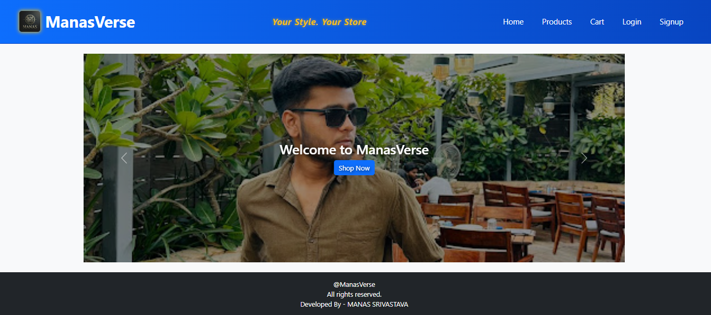
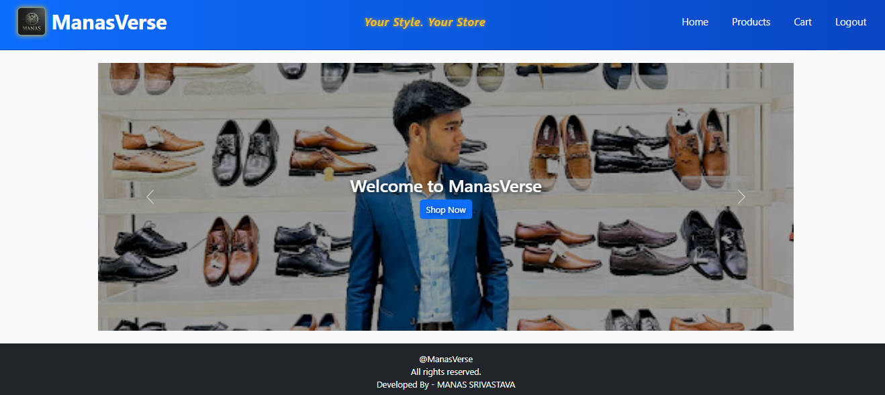
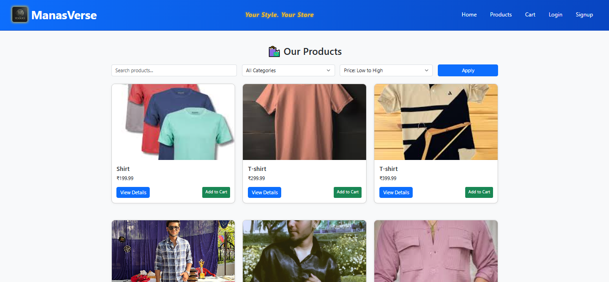
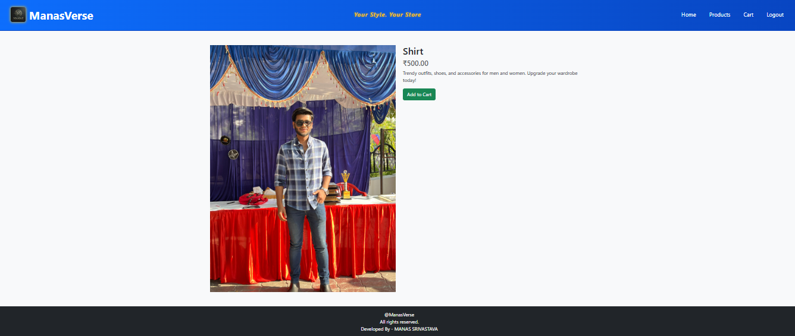
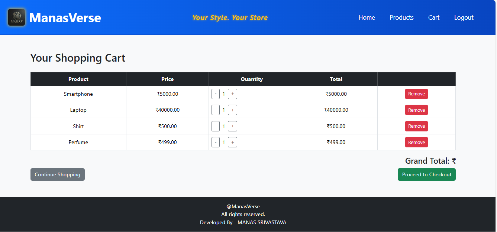
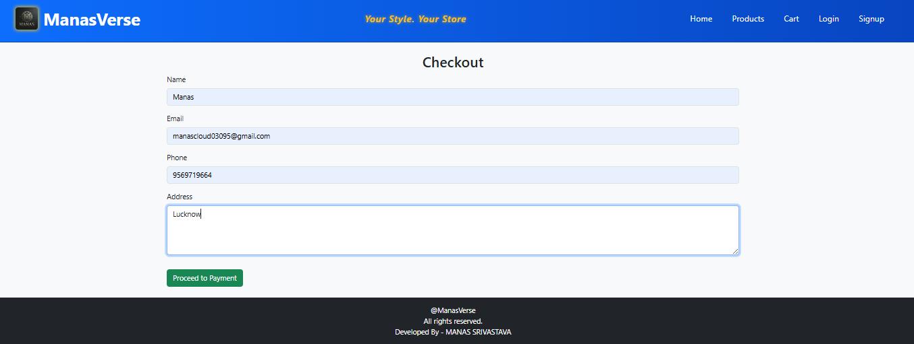
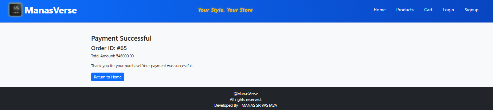
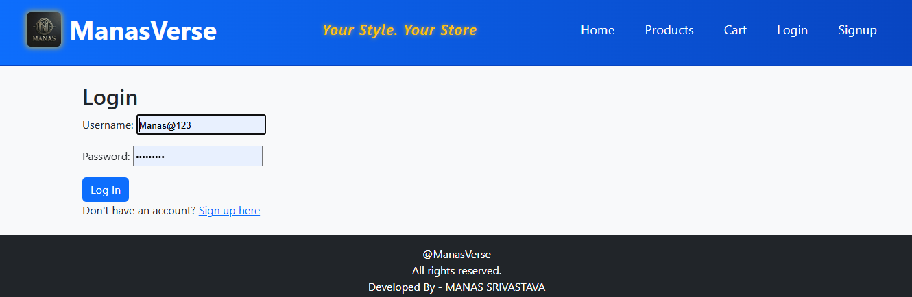

🛒 ManasVerse – Django eCommerce Project
A responsive and dynamic eCommerce platform built from scratch with Django by Manas Srivastava.

---

## 🚀 Features

### ✅ Core Features (Completed)
- Full Django backend with session-based cart
- Product listing, filtering, sorting, and search
- Product detail view with "Add to Cart"
- Cart view with quantity, total, and remove options
- Checkout page & order summary ✅
- Email confirmation after successful order ✉️
- User login and signup functionality 🔐
- Bootstrap-powered responsive UI
- Home page carousel with "Shop Now" .
- Admin panel to manage products

---

## 🖼️ UI Screenshots

### 🔹 Home Page (Slider)

### 🔹 Home Page (With Products)

### 🔹 Product Page

### 🔹 Product Detail Page

### 🔹 Cart Page

### 🔹 Checkout Page

### 🔹 Payment Confirmation

### 🔹 Login Page

## ⚙️ Tech Stack

- Python 3.x
- Django 4.x
- HTML5, CSS3, Bootstrap
- SQLite (default) – swappable with PostgreSQL
- Git + GitHub

---

## 📁 Folder Structure
Ecommerce/
├── ManasVerse/ # Main Django app
├── static/ # CSS, JS, Images
├── templates/ # HTML templates
├── screenshots/ # UI screenshots
├── db.sqlite3 # SQLite database
├── manage.py # Django CLI
└── README.md # You're here!

---

## 👨‍💻 Developed By

**Manas Srivastava**  
📧 Email: [manasworks04@gmail.com](mailto:manasworks04@gmail.com)  
🌐 GitHub: [manas-onGit](https://github.com/manas-onGit)

---

## 📌 License

This project is licensed for learning and portfolio purposes. Contact me for commercial use.

